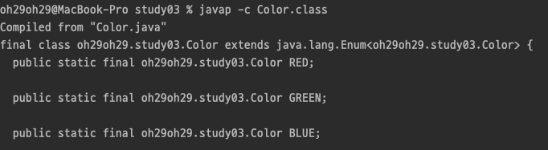
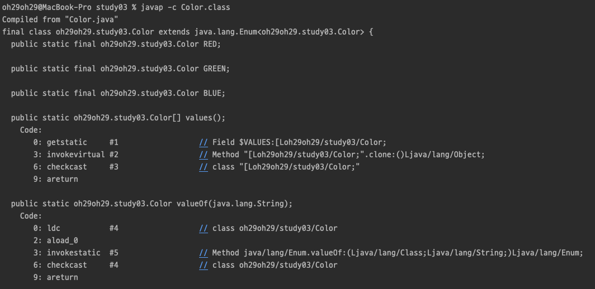

# Java Enumeration

열거형은 상수 그룹을 나타내는 목적으로 사용된다.  
열거형 상수 집합이 항상 고정된 상태로 유지 될 필요는 없다.  
Java 에서는 변수, 메서드 및 생성자를 추가할 수도 있다. enum 의 주요 목적은 데이터 유형을 정의하는 것이다.

enum 키워드는 Java 5 부터 도입되었다.  
enum 으로 정의된 상수는 코드를 더 일기 쉽게 만들고 컴파일 타임 검사를 허용하며, 허용된 값 목록을 미리 문서화하고 잘못된 값이 전달되어 예기치 않은 동작을 방지할 수 있다.

enum 선언은 클래스 외부 또는 클래스 내부에서 할 수 있지만 메서드 내부에서는 할 수 없다.

## 상수의 표현

#### final 을 사용한 상수

final 키워드를 사용하여 불변하게 만들고 static 키워드를 사용하여 클래스 변수로 지정하여 상수를 만들 수 있다.

```java
public class Constants {
    private static final int A = 0;
    private static final int B = 1;
    private static final int C = 2;

    public void print(int type) {
        switch (type) {
            case A:
                System.out.println("This is Upper A");
                break;
            case B:
                System.out.println("This is Upper B");
                break;
            case C:
                System.out.println("This is Upper C");
                break;
        }
    }
}
```

하지만 이렇게 코드를 작성하게 되면 문제점이 몇가지 발생한다.

#### 1. 변수명의 중복  
현재 정의된 'A' 말고 다른 의미의 'A' 상수가 필요하게 됐을 경우, 변수명의 중복이 생길 수 있다.  
이때는 접두사를 붙여서 중복 문제를 피해갈 수는 있지만 코드가 길어지고 복잡해질 수 있기 때문에 좋은 방법은 아니다. 

#### 2. typesafe 하지 않은 코드  
동일한 값을 가진 다른 의미의 상수에 대하여 컴파일 단계에서 확인할 수 없기 때문에 실수의 여지가 존재한다.  
```java
public class Constants {
    private static final int UPPER_A = 0;
    private static final int UPPER_B = 1;
    private static final int UPPER_C = 2;

    private static final int LOWER_A = 0;
    private static final int LOWER_B = 1;
    private static final int LOWER_C = 2;

    public void print(int type) {
        switch (type) {
            case UPPER_A:
                System.out.println("This is Upper A");
                break;
            case UPPER_B:
                System.out.println("This is Upper B");
                break;
            case UPPER_C:
                System.out.println("This is Upper C");
                break;
        }
    }

    public static void main(String[] args) {
        Constants constants = new Constants();
        constants.print(LOWER_A);
    }
}
```
```text
This is Upper A
```
위와 같은 코드가 있다면 실제 원하는 값은 대문자에 대한 결과이지만 `type` 값에 소문자 상수를 넣어도 동작한다.  
이런 문제는 enum 을 사용함으로써 해결할 수 있다.

```java
public class Constants {
    
    enum Upper {
        A, B, C;
    }
    
    enum Lower {
        A, B, C;
    }

    public void print(Upper type) {
        switch (type) {
            case A:
                System.out.println("This is Upper A");
                break;
            case B:
                System.out.println("This is Upper B");
                break;
            case C:
                System.out.println("This is Upper C");
                break;
        }
    }

    public static void main(String[] args) {
        Constants constants = new Constants();
        constants.print(Lower.A);
    }
}
```
`constants.print(LOWER.A);` 코드에서 컴파일 에러가 나는 것을 확인할 수 있다. 즉, typesafe 함을 보장할 수 있게 된 것이다.  

## Enum 정의

- `enum` 키워드를 사용하여 정의한다.
- 열거형은 상수의 집합이기 때문에 필드명은 대문자로 표기한다. 

```java
enum Color {
    RED, GREEN, BLUE;
}
```

`enum` 은 내부적으로 클래스이다. 또한 필드들은 묵시적으로 `public static final` 로 정의된다.  



#### Enum and Inheritance

모든 enum 들은 묵시적으로 `java.lang.Enum` 클래스를 상속받는다. 그렇기 때문에 enum 은 다른 클래스를 상속받지 못한다.  
반면 인터페이스는 구현할 수 있다.

## java.lang.Enum

```java
public final String name()
public final int ordinal()
public String toString()
public final boolean equals(Object obj)
public final int hashCode()
public int compareTo(E obj)
public static <T extends Enum> T valueOf(Class enumType, String name)
public final Class <E> getDeclaringClass() // enum 객체의 타입 반환
public final Object clone() throws CloneNotSupportedException
protected final void finalize()
```

#### 1. name()  
열거형 상수의 이름을 문자열로 반환한다.
#### 2. ordinal()  
열거형 상수가 정의된 순서(0부터 시작)를 정수로 반환한다.
#### 3. toString()  
열거형 상수의 이름을 문자열로 반환한다. 이게 가능한 이유는 `java.lang.Enum` 에서 재정의를 하기 때문이다.
#### 4. getDeclaringClass()  
열거형의 Class 객체를 반환한다.
#### 5. T valueOf(Class enumType, String name)
정의된 열거형에서 name 과 일치하는 열거형 상수를 반환한다.

## values() 와 valueOf()

위에서 본 `java.lang.Enum` 클래스에서는 values(), valueOf() 메소드에 대한 내용을 자세히 찾아볼 수 없다.  
그 이유는 컴파일러가 자동으로 추가해 주는 메서드이기 때문이다.   



컴파일까지 실행한 후 바이트코드를 살펴보면 static 으로 선언되어 있는 메서드 2개를 확인할 수 있다.

values() 메서드는 enum 내에 있는 모든 값을 알고 싶을 때 사용할 수 있다.  
valueOf() 메서드는 지정된 문자열 값과 일치하는 열거형 상수가 존재할 경우 반환한다.

## EnumSet

EnumSet 은 Enum 유형과 함께 사용하기 위한 Set 구현이다.  
EnumSet 은 RegularEnumSet 및 JumboEnumSet 이라는 두 가지 구현이 있는 추상 클래스이며, 그중 하나는 인스턴스화 할 때 열거형의 상수 수에 따라 선택된다.

#### 메서드 활용

```java
enum Color {
    RED, GREEN, BLUE, YELLOW, ORANGE;
}
```
```java
public class Main {
    public static void main(String[] args) {
        EnumSet<Color> allColorSet = EnumSet.allOf(Color.class);
        System.out.println("EnumSet.allOf(Color.class)");
        System.out.println(allColorSet);
        System.out.println();

        EnumSet<Color> defaultColorSet = EnumSet.of(Color.RED, Color.GREEN, Color.BLUE);
        System.out.println("EnumSet.of(Color.RED, Color.GREEN, Color.BLUE)");
        System.out.println(defaultColorSet);
        System.out.println();

        System.out.println("전체에서 defaultColorSet 제외");
        System.out.println(EnumSet.complementOf(defaultColorSet));
        System.out.println();

        System.out.println("BLUE 에서 ORANGE 범위 출력");
        System.out.println(EnumSet.range(Color.BLUE, Color.ORANGE));
    }
}
```
```text
EnumSet.allOf(Color.class)
[RED, GREEN, BLUE, YELLOW, ORANGE]

EnumSet.of(Color.RED, Color.GREEN, Color.BLUE)
[RED, GREEN, BLUE]

전체에서 defaultColorSet 제외
[YELLOW, ORANGE]

BLUE 에서 ORANGE 범위 출력
[BLUE, YELLOW, ORANGE]
```

## 추가로

#### ordinal()

`Enum` 에서 제공해주는 ordinal() 메서드는 실제 개발자는 사용하면 안되는 메서드이다.  

```text
Most programmers will have no use for this method. 
It is designed for use by sophisticated enum-based data structures, such as java.util.EnumSet and java.util.EnumMap.
```

ordinal() 메서드를 설명해주는 내부 API 문서에도 위와 같이 작성되어 있다.  

ordinal() 메서드는 현재 정의되어 있는 순서(위치) 를 반환해주기 때문에 해당 값으로 무언가 판단하여 코드를 작성했을 경우, 나중에 혹시 순서가 바뀐다면 예기치 못한 버그를 만들어낼 수 있다.  
따라서 해당 메서드 사용은 지양하고 다른 방법으로 구현해야 한다.

<hr>

#### References

> 웹 문서
> - [geeksforgeeks | enum in Java](https://www.geeksforgeeks.org/enum-in-java/)
> - [geeksforgeeks | Enum with Customized Value in Java](https://www.geeksforgeeks.org/enum-customized-value-java/)
> - [baeldung | A Guide to Java Enums](https://www.baeldung.com/a-guide-to-java-enums)
> - [baeldung | Attaching Values to Java Enum](https://www.baeldung.com/java-enum-values)
> - [ljs0429777.log | 11주차 과제 : Enum](https://velog.io/@ljs0429777/11%EC%A3%BC%EC%B0%A8-%EA%B3%BC%EC%A0%9C-Enum)
> - [개발자 한선우 | 11주차 과제: Enum](https://yadon079.github.io/2021/java%20study%20halle/week-11)